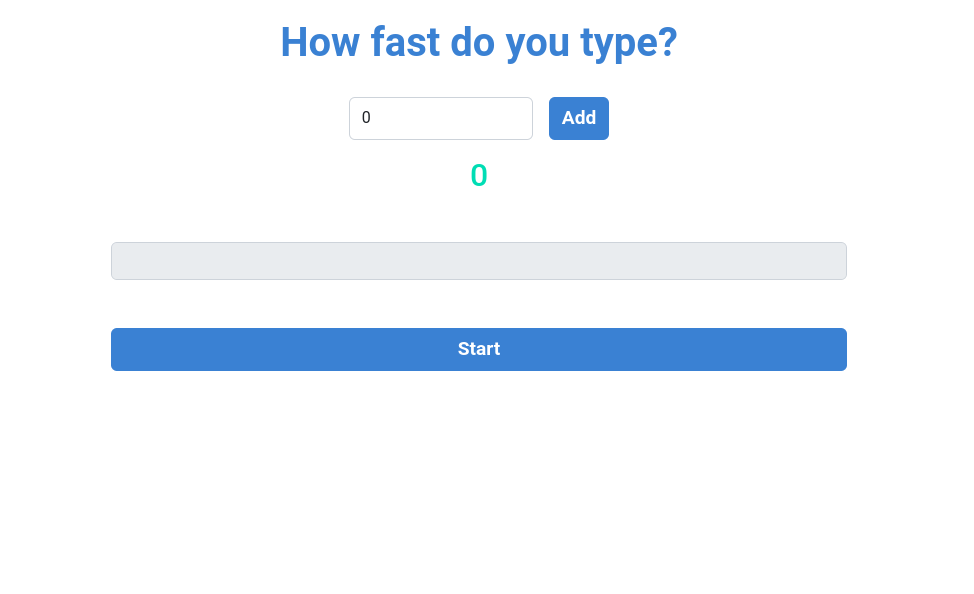
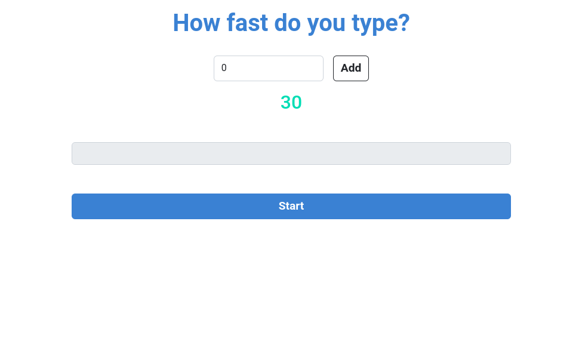
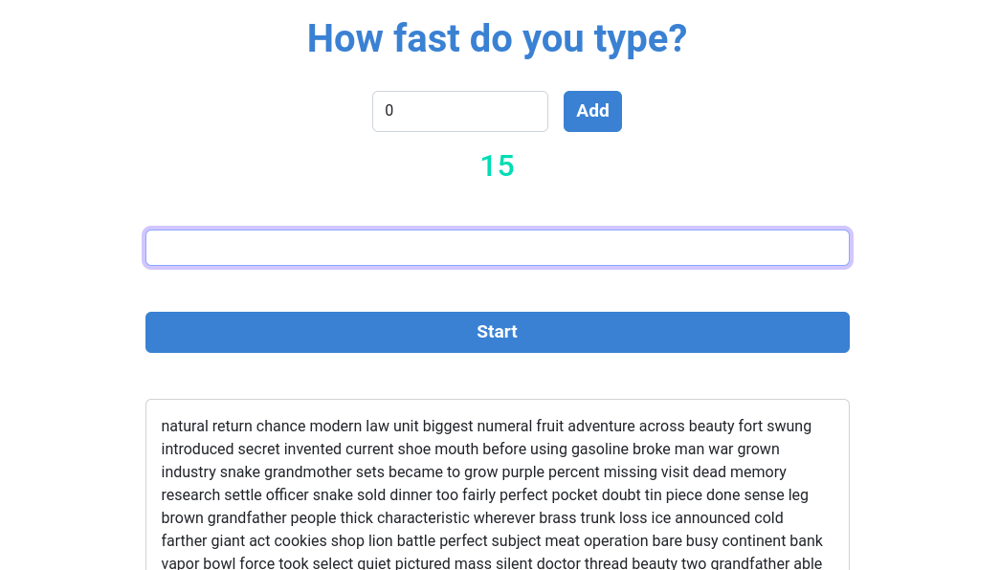
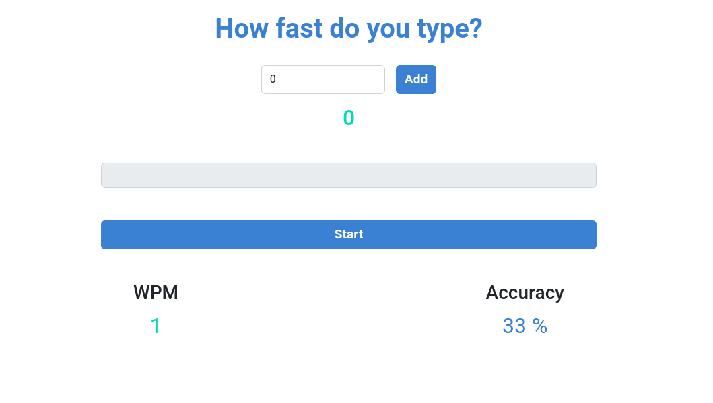

# Typing Speed App 

> This is a typing speed app built with nextjs and react. You set the timer by typing any seconds of your choice and press start button to fire up the game. Your words per minute and the accuracy of your typing would be calculated and displayed after your time expires. My plan is to add more features to the app in future and decompose the homepage component into several components









## ⚒️  Built with

- Html
- Css
- JavaScript
- React
- Nextjs

## 🎞️ Frameworks and Technologies used

- Bootstrap
- Webpack
- HTML
- CSS
- JavaScript
- ReactJS
- NextJS

## 🖥️ Live Demo
- [Vercel](https://typing-speed-game-tau.vercel.app/) :point_left:

## Getting Started

To get a local copy up and running on your machine, follow these simple steps.
Enter this in your terminal 👇 
``` 
  git clone git@github.com:Qoosim/typing-speed-game.git 
``` 
## 🛠️ Prerequisites
```
  Install Node.js on your machine
```
## 🕹️ Setup
```
  Clone the repository on your machine and cd into it
  run npm install
  run npm run dev 
```
## Author

👤 **Qoosim AbdulGhaniyy**

- GitHub: [Qoosim](https://github.com/Qoosim)
- LinkedIn: [Qoosim](https://www.linkedin.com/in/qoosim)

## 🤝 Contributing

Contributions, issues, and feature requests are welcome!

Feel free to check the [issues page](../../issues/).

## Show your support

Give a ⭐️ if you like this project!

## Acknowledgments

- To those assist in understanding the concept of React 

## 📝 License

This project is [MIT](./MIT.md) licensed.
